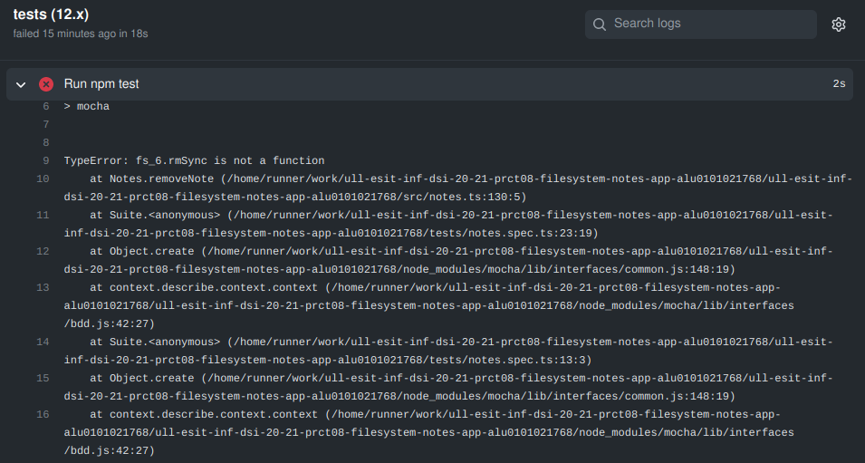

# Práctica 8 - Aplicación de procesamiento de notas de texto

## Tareas previas 

Como tareas previas para el desarrollo de esta aplicación he estudiado la documentación correspondiente a los paquetes y herramientas a usar, como son en este caso los paquetes ```yargs``` y ```chalk``` así como también la [API síncrona proporcionada por Node.js para trabajar concretamente con el sistema de ficheros](https://nodejs.org/dist/latest-v15.x/docs/api/fs.html#fs_synchronous_api). 

Cabe añadir que durante el desarrollo traté de hacer uso exclusivo de funciones síncronas y tratando de evitar las asíncronas ya que no van acorde a los contenidos de esta práctica.

## Diseño de clases 

Para esta práctica no vi conveniente crear una gran estructura de clases, ya que al simplemente tener que operar con el sistema de archivos solo requerimos de una clase que está relacionada con la persistencia de datos y otra que se encargue de procesar los comandos ejecutados por la terminal y llame a las funciones de la otra.

Por lo tanto, he diseñado una sola clase llamada ```Notes```, la cual he planteado como una clase Singleton ya que todas las operaciones relacionadas con notas,creo que deberían ir asociadas a una base de datos, y ya que esta clase será la encargada de crear, leer, modificar, borrar y listar notas, creo que todas estas operaciones se deberían de realizar sobre una única instancia de la clase.

Considero que se podría haber complicado el diseño un poco si quisiéramos tratar a los usuarios como una clase también, pero en este caso simplemente se verifica que un usuario tenga un directorio con sus notas, y si no lo tiene se le crea.

## Solución propuesta

### Procesamiento de comandos - ```app.ts```

Lo primero a tener en cuenta para el desarrollo de esta práctica ha sido plantear como ibamos a procesar los comandos ejecutados por terminal, para lo cual he usado ```yargs``` como se requería y proceso todos estos comandos desde un archivo llamado ```app.ts``` que podríamos verlo como si fuera la parte del código cliente, ya que desde ahí se llama a todas las funciones diseñadas en la clase ```Notes```.

Primero que nada, guardo en una variable la instancia de la clase ```Notes```, ya que sobre ella haremos las llamadas a los métodos estéticos desde el correspondiente snippet de código parseado por el paquete ```yargs```.

Todos estos snippets presentan una estructura similar a la siguiente: 

```typescript
yargs.command({
  command: 'read',
  describe: 'Reads a note',
  builder: {
    user: {
      describe: `Note's list owner`,
      demandOption: true,
      type: 'string',
    },
    title: {
      describe: 'Note title',
      demandOption: true,
      type: 'string',
    },
  },
  handler(argv) {
    if (typeof argv.user === 'string' && typeof argv.title === 'string') {
      const result = notesInstance.readNote(argv.user, argv.title);
      console.log(result);
    }
  },
});
```

Como podemos ver, la trata de los argumentos es bastante sencilla, simplemente indicamos cuales son los comandos que esperamos, si son obligatorios o no y qué tipo de dato tienen. 
De resto solo queda trabajar con el handler para indicar que acciones queremos que realize tras procesar la información recogida.

Con el resto de comandos funciona igual, lo que difieren son los argumentos esperados en cada caso, ya que por ejemplo en la acción de modificar, sólo son obligatorios el nombre del usuario y el título de la nota, pero el resto de campos son opcionales, ya que el usuario es el que decide si quiere cambiar el cuerpo o el color de la nota si así lo desea.

Otro detalle destacable dentro de esta parte del código cliente sería el como parseo los datos que se guardan dentro de ```argv``` para pasarlos a los métodos sin problemas, para lo cual me ayudo de un archivo aparte llamado ````helpers.ts``` donde tengo planteadas las siguientes estructuras de datos: 

```typescript
/**
 * @description Interface used to parse the arguments received from the yargs
 * commands
 */
export interface noteInterface {
  user: string,
  title: string,
  body: string,
  color: string
}
/**
 * @description Object used to manage the colors that i will use with chalk
 */
export const ColorStruct = {
  red: "Red",
  yellow: "Yellow",
  green: "Green",
  blue: "Blue",
};
```

Como podemos observar, utilizo una interfaz que me permite asegurar el tipo de dato de los diferentes datos recibidos, para así poder pasarlos a las funciones de la clase ```Notes``` de manera limpia y sin ningún tipo de error de compilador.

Por otro lado, he creado un objeto definiendo como propiedades los colores y como valores los propios valores de cada uno de los colores indicados, para de esta manera facilitarme la tarea de distinguir los colores de cada nota y añadirlo sin complicaciones al texto correspondiente.

Por último, en lo referente a este archivo solo queda hacer la llamada al ```yargs.parse()``` para que procese todo aquel comando que se ejecute en la terminal y llame a las funciones necesarias que realizarán sus respectivas operaciones.

### Operaciones con el filesystem - ```notes.ts```

Los ```imports``` que utilizamos para trabajar en esta parte son los siguientes: 


En este caso, al ser una clase singleton, el único atributo relevante que trato en la clase es el de la instancia de la propia clase, por lo que el constructor está vacío y la creación de la instancia de la clase o la obtención de la misma en caso de que ya exista, es a través de un método que precisamente devuelve la instancia única de la clase si es que existe, y de lo contrario la crea y la devuelve.

Respecto de las operaciones, las cuales son añadir, modificar, eliminar, leer y listar notas, iré una a una explicando el planteamiento desarrollado para cada una de ellas.

#### Añadir notas

Para añadir notas requerimos de todos los parámetros (usuario, título, cuerpo y color de la nota), ya que con ellos creo un string formateado como si fuera un JSON para que cuando queramos leer del fichero, podamos hacerlo de manera cómoda.

Luego de esto, pillo la ruta a la carpeta del usuario, la cual se crea si no existe aún, y luego compruebo que no exista ya una nota con el mismo título para el mismo usuario, ya que en dicho caso mostraremos un error, y si no es así, simplemente creamos la nota mediante el uso del método ````writeFileSync``` y devolvemos un mensaje de éxito.

#### Leer notas

Lo primero que realizo para leer las notas de un usuario, es conseguir la ruta a su directorio, y haciendo uso de ```readdirSync``` puedo definir una callback, para plantear que es lo que quiero hacer con cada fichero que hay dentro del directorio, con lo que en este caso simplemente uso ````readFileSync``` para guardar el contenido de cada fichero que voy recorriendo y luego parseo a objeto el contenido mediante el uso de ```JSON.parse(data.toString())``` porque habíamos metido la información formateada de manera que ahora podremos extraerla como un objeto.

Con estos datos ya simplemente queda poner lo que se mostrará por pantalla y gestionar los colores de cada título.

#### Modificar notas

Para modificar notas opero igual que al añadirlas, pero con el extra de que en este caso, los parámetros del cuerpo y el color de la nota son opcionales, y compruebo si son ```undefined``` para en ese caso dejar los contenidos que tenía la nota previamente, pero si se sobreescribe alguno de estos campos, simplemente se actualiza.

#### Eliminar notas

Para eliminar notas simplemente comprobamos que exista la nota que se quiere eliminar, en cuyo caso se eliminará y si no se mostrará un mensaje de error.

#### Leer notas

Para leer una nota, se accede al directorio del usuario y a la nota concreta, si no existe, se muestra un error y si por lo contrario la nota existe, se cogen los datos de la misma, se parsean a objeto y de esta manera puedo formatear el texto con el color correspondiente para mostrarlo como se espera.

## Problemas durante el desarrollo

He tenido bastante problemas con el desarrollo, sobre todo en la parte relativa a las Github Actions, ya que al parecer las funciones del filesystem de node hacen caer la mayor parte de mis github actions, no dejándolas correr, al menos en las relativas a los tests.

Lo que he realizado para que al menos puedan correr el resto de acciones de github, ha sido tratar de que funcionaran los tests en al menos una de las versiones de node, que parecía no tirarme ningún stack de errores, pero sin embargo procesaba los tests de manera distinta que mi versión de node, ya que los tests en mi máquina iban, pero si quería que fuera en alguna de las versiones de node que corrían en la Github Action de Node.js pues dejarían de funcionarme en mi máquina, pero así lo hize para que al menos puedan ir el coverage y el sonar cloud.


Aparentemente, la función de la que más se quejan las máquinas que corren los tests es de la ```rmSync```, aunque no entiendo por qué sucede esto.
Adjunto la pila de errores que me devuelve para que se haga una idea de lo que comento: 



Sinceramente, he dedicado muchas horas a tratar de solventar este problema pero no lo he conseguido, si usted sabe a que se debe, me gustaría que me lo hiciera saber, ya que tengo curiosidad de a que se podría deber y si es fallo mío o no.

## Conclusiones

He aprendido bastante a trabajar con el sistema de archivos de node de manera síncrona y me ha parecido bastante fácil y cómodo de usar, así como también me han parecido bastante interesantes los paquetes utilizados en el desarrollo como son ```yargs``` y ```chalk```, tanto como para posiblemente incluirlos en algún futuro proyecto que me requiera de procesar comandos de esta manera mediante terminal, ya que facilitan bastante el proceso.
